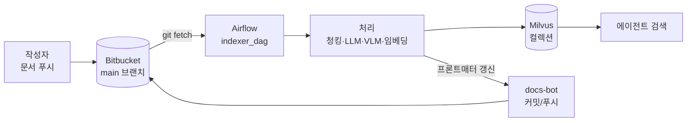

# Git 기반 마크다운 RAG 인덱싱 파이프라인

사내 Bitbucket 레포의 마크다운 문서를 주기적으로 수집해 **에이전트 검색**이 활용할 Milvus 벡터 인덱스로 변환·유지하는 사내용 인덱싱 파이프라인.

---

## 이런 걸 해결합니다

- **분산된 개인 지식의 집약**: 각자 로컬에만 두던 마크다운 문서들을 공용 레포의 개인 디렉토리에 모아 조직이 함께 검색할 수 있게 함.
- **최신성 유지 부담 해소**: 문서가 계속 바뀌어도 검색 인덱스가 자동으로 따라옴.
- **작성자 인지 부하 최소화**: 작성자는 개인 디렉토리에 `.md`를 올리기만 하면 되고, 청킹·캡션 생성·벡터화는 모두 자동.
- **디렉토리 이동에 강건**: 문서를 다른 위치로 옮기거나 이름을 바꿔도 영속 식별자(`doc_id`)가 유지되어 재임베딩 없이 메타만 갱신됨.
- **본문은 사용자 소유**: 파이프라인은 프론트매터만 건드리며 본문에는 손대지 않음 → `git blame` 노이즈 없음.

---

## 전체 그림

---

## 어떻게 작동하나

Airflow DAG 한 번의 실행은 다음 순서로 진행됩니다. 실행 주기·트리거 정책은 운영 환경에 맞춰 별도로 결정합니다.

1. **폴링** — 봇이 `main` 브랜치를 `git fetch`하고, 마지막 색인 커밋 이후의 변경을 확인.
2. **대상 수집** — 다음 세 집합을 합쳐 처리 대상(target set)을 정함:
   - 변경된 `.md` 파일
   - 변경된 이미지가 참조되는 `.md` 파일
   - 이전 실행에서 실패한 `.md` 파일
3. **가공** — 대상 문서마다 병렬로:
   - 본문 청킹 (heading 기반 분할)
   - 이미지는 VLM이 캡션 생성 → 프론트매터 `images` 필드에 기록
   - LLM이 `summary`, `doc_type`, `topics`, `language` 추출
4. **임베딩 & 적재** — BGE-M3로 dense + sparse 벡터를 만들어 Milvus에 upsert. 이어서 같은 문서의 **Stale 청크**를 삭제해 최신 상태만 유지.
   > **Stale 청크란?** 이전 색인에는 존재했지만 이번 청킹 결과에는 더 이상 없는 과거 조각. 예를 들어 문서가 축약돼 청크 개수가 12→8로 줄면 9~12번 자리에 남아 있던 옛 청크가 Stale이 됩니다. 정리하지 않으면 검색 결과에 유령 청크가 섞일 수 있음.
5. **봇 커밋** — 갱신된 프론트매터와 `.pipeline/state.json`을 `docs-bot` 계정으로 한 커밋에 묶어 `main`에 push. **푸시 충돌이 발생하면 프론트매터 예약 필드는 봇이 방금 만든 값을 우선 적용**(`-X ours` rebase) — 사용자가 예약 필드를 수정한 상태로 머지되어도 봇의 최신 색인 결과가 덮어씁니다. 본문은 건드리지 않으므로 본문 충돌은 원천 발생하지 않음.

> 실패한 문서는 프론트매터에 `indexing_status: failed`가 기록되고, 다음 실행에서 자동 재시도됩니다. 문서 하나의 실패가 전체 실행을 막지 않습니다.

---

## 무엇이 바뀌나

### 레포에 생기는 변화
- 각 `.md` 상단에 **프론트매터 예약 필드**가 자동 추가·갱신됨 (아래 참조)
- 레포 루트에 **`.pipeline/` 디렉토리**가 생김 (봇 전용, 수동 편집 금지)
- `docs-bot` 저자의 색인 커밋이 히스토리에 나타남. **본문은 절대 수정되지 않으므로** `git blame`이 흐려지지 않음

### 프론트매터 예약 필드

파이프라인이 직접 생성·갱신하는 필드. 사용자가 수정해도 다음 색인에서 봇이 덮어씁니다.

**식별 / 버전**

| 필드 | 용도 |
|---|---|
| `doc_id` | 문서의 영속 식별자 (UUID v4). 이동·이름 변경에도 불변 |
| `path` | 현재 레포 내 상대 경로 |
| `content_hash` | 프론트매터를 제외한 본문 해시. 변경 감지 기준 |
| `last_indexed_commit` | 마지막으로 색인된 git 커밋 SHA |
| `last_indexed_at` | 마지막 색인 시각 (ISO 8601) |
| `pipeline_schema_version` | 프론트매터 스키마 버전 |
| `chunk_strategy_version` | 청킹 전략 버전 |
| `embedding_model` | 임베딩 모델 식별자 |
| `vision_schema_version` | 이미지 처리 스키마 버전 |

**내용 분류 (LLM 자동 생성)**

| 필드 | 용도 |
|---|---|
| `title` | 문서 제목 (본문 첫 H1 또는 LLM 보정값) |
| `summary` | 한 줄 요약 (50~100자) |
| `doc_type` | 문서 타입 분류 |
| `topics` | 주요 키워드 (3~7개) |
| `language` | 언어 (`ko` / `en` / `mixed`) |

**Git 유래 메타**

| 필드 | 용도 |
|---|---|
| `authors` | 주요 기여자 (git log 기반 상위 5명) |
| `created_at` | 최초 커밋 시각 |
| `updated_at` | 최근 본문 변경 커밋 시각 |

**운영 상태**

| 필드 | 용도 |
|---|---|
| `chunk_count` | 현재 청크 수 |
| `has_images` | 이미지 포함 여부 |
| `indexing_status` | `ok` / `failed` / `excluded` / `pending` |
| `web_url` | Bitbucket 원문 URL |

**이미지 설명**

| 필드 | 용도 |
|---|---|
| `images` | 본문 이미지별 VLM 캡션과 섹션 경로 배열 |

### 사용자 필드

예약 목록에 없는 키는 사용자 자유 영역. 팀 메타데이터를 자유롭게 추가할 수 있으며, 파이프라인은 읽기만 하고 그대로 보존합니다. Milvus에는 `user_meta` JSON 필드에 통째로 저장되어 에이전트 검색의 필터 조건으로 활용 가능.

### 특수 플래그

| 필드 | 용도 |
|---|---|
| `rag_exclude` | `true`면 색인 제외. 기존 청크는 Milvus에서 즉시 삭제되고, 프론트매터는 `indexing_status: excluded`로 유지 |

### 작성자가 알아야 할 규칙
- 인덱싱 대상은 **`main`에 올라온 `.md`**. feature 브랜치 상태는 검색에 노출되지 않음
- 이미지는 참조하는 `.md`와 **같은 디렉토리 또는 하위**에 둘 것 (외부 URL·심볼릭 링크는 처리되지 않음)
- 문서 이동·이름 변경은 `git mv`로 — `doc_id`가 유지되어 재임베딩 없이 메타만 갱신됨
- 민감 문서를 색인에서 빼려면 프론트매터에 `rag_exclude: true` 추가

### 에이전트 검색이 보게 되는 것
- 단일 Milvus 컬렉션에 **본문 청크**와 **이미지 청크**가 `chunk_kind` 필드로 구분되어 공존
- 랭킹·리랭커·에이전트 도구 설계는 **이 파이프라인의 책임이 아님** — 에이전트 검색 측에서 결정

---

## 세팅 (요약)

### 전제 조건
- **Bitbucket 레포** — `main` 브랜치 push 권한을 가진 서비스 계정(`docs-bot` 등) + SSH 키
- **Airflow 2.x** — 사내 클러스터 (DAG 배포 가능)
- **Milvus 2.5+** — 하이브리드 검색(dense + sparse)을 지원하는 버전
- **사내 호스팅 모델 엔드포인트** — BGE-M3 (임베딩), LLM (요약/분류), VLM (이미지 캡션)
- **시크릿 저장소** — Vault 또는 K8s Secret (SSH 키, 엔드포인트 토큰)

### 구성 파일
레포 배포물에 `pipeline-config.yaml`을 두고 Airflow 워커에서 로드합니다. 주요 키:
- `repo` — Bitbucket SSH URL, 브랜치, 로컬 워크디렉토리
- `milvus` — 호스트/포트/컬렉션 이름
- `embedding` / `llm` / `vision` — 모델 엔드포인트와 모델명
- `chunking` — 청크 크기·오버랩·분할 헤더
- `schedule` — 폴링 주기 (운영 환경에 맞춰 결정)
- `bot` — 봇 저자 이름·이메일, 푸시 재시도 정책

상세 키와 기본값은 설계 문서 §6을 참조하세요.

### 최초 배포 흐름
1. 위 전제 조건을 준비하고 설정 파일을 작성
2. Airflow에 `indexer_dag` 배포 + 봇 SSH 키 마운트
3. 첫 실행에서 `.pipeline/state.json`이 없으므로 **레포 전체 `.md`를 초기 색인**하고 봇 커밋으로 프론트매터를 채움
4. 이후 실행은 커밋 단위 diff만 처리

> 모델·청킹 전략·프론트매터 스키마가 바뀔 때는 `pipeline-backfill.py`로 Shadow 컬렉션을 만들어 무중단 교체합니다.

---

## 범위와 비범위

**이 프로젝트가 다루는 것**
- Bitbucket **단일 레포**의 `main` 브랜치 `.md` 파일
- 본문에 삽입된 이미지의 VLM 캡션
- 변경 동기화(추가/수정/삭제/이동) 및 최종 일관성
- 프론트매터 예약 필드의 자동 관리

**다루지 않는 것**
- 에이전트 검색 구현 (랭킹·리랭커·에이전트 도구·UI)
- 문서 단위 권한 제어 (레포 단위 read 권한으로 경계 삼음)
- `.md` 외 포맷 (Confluence/Notion/PDF/Office)
- 외부 URL 이미지, 심볼릭 링크
- `main` 외 브랜치, 실시간(sub-second) 반영
- Bitbucket 외의 Git 호스팅
