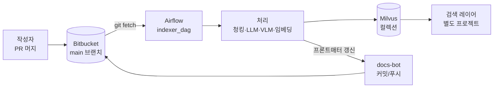

# Git 기반 마크다운 RAG 인덱싱 파이프라인

사내 Bitbucket 레포의 마크다운 문서를 주기적으로 수집해 RAG 검색이 활용할 Milvus 벡터 인덱스로 변환·유지하는 사내용 인덱싱 파이프라인.

---

## 이런 걸 해결합니다

- **분산된 사내 지식**: 런북·정책·회의록·스펙이 Bitbucket `.md`로 흩어져 있어 RAG 챗봇이 바로 쓰기 어려움.
- **최신성 유지 부담**: 문서가 계속 바뀌는데 검색 인덱스는 따라가지 않음.
- **작성자 인지 부하 최소화**: 문서 작성자는 평소처럼 PR을 머지하기만 하면 되고, 인덱싱은 알아서 됨.
- **본문은 사용자 소유**: 파이프라인은 프론트매터만 건드리며 본문에는 손대지 않음 → `git blame` 노이즈 없음.

---

## 전체 그림

---

## 어떻게 작동하나

파이프라인은 Airflow DAG로 주기적(기본 3분)으로 돕니다. 한 번의 실행은 다음 순서로 진행됩니다.

1. **폴링** — 봇이 `main` 브랜치를 `git fetch`하고, 마지막 색인 커밋 이후의 변경을 확인.
2. **대상 수집** — 다음 세 집합을 합쳐 처리 대상(target set)을 정함:
   - 변경된 `.md` 파일
   - 변경된 이미지가 참조되는 `.md` 파일
   - 이전 실행에서 실패한 `.md` 파일
3. **가공** — 대상 문서마다 병렬로:
   - 본문 청킹 (heading 기반 분할)
   - 이미지는 VLM이 캡션 생성 → 프론트매터 `images` 필드에 기록
   - LLM이 `summary`, `doc_type`, `topics`, `language` 추출
4. **임베딩 & 적재** — BGE-M3로 dense + sparse 벡터를 만들어 Milvus에 upsert. 같은 문서의 오래된 청크는 삭제(stale 정리).
5. **봇 커밋** — 갱신된 프론트매터와 `.pipeline/state.json`을 `docs-bot` 계정으로 한 커밋에 묶어 `main`에 push. 충돌 시 `-X ours` rebase로 예약 필드만 봇 우선 적용.

> 실패한 문서는 프론트매터에 `indexing_status: failed`가 기록되고, 다음 실행에서 자동 재시도됩니다. 문서 하나의 실패가 전체 실행을 막지 않습니다.

---

## 무엇이 바뀌나

### 레포에 생기는 변화
- 각 `.md` 상단에 **프론트매터 예약 필드**가 자동 추가·갱신됨 (`doc_id`, `title`, `summary`, `doc_type`, `topics`, `images`, `indexing_status` 등)
- 레포 루트에 **`.pipeline/` 디렉토리**가 생김 (봇 전용, 수동 편집 금지)
- `docs-bot` 저자의 주기적 커밋이 히스토리에 나타남. **본문은 절대 수정되지 않으므로** `git blame`이 흐려지지 않음

### 작성자가 알아야 할 규칙 (요약)
- 인덱싱 대상은 **`main`에 머지된 `.md`**. feature 브랜치/PR 상태는 검색에 노출되지 않음
- **예약 필드는 사용자가 건드려도 다음 실행에서 봇이 덮어씀** (CI는 경고만, 차단 없음)
- **사용자 필드는 보존됨** — 팀 메타데이터를 자유롭게 추가 가능
- 이미지는 참조하는 `.md`와 **같은 디렉토리 또는 하위**에 둘 것 (외부 URL·심볼릭 링크는 처리되지 않음)
- 특정 문서를 색인에서 빼고 싶으면 프론트매터에 `rag_exclude: true` 추가 → 해당 문서의 청크가 Milvus에서 제거됨

### 검색 레이어에 노출되는 것
- 단일 Milvus 컬렉션에 **본문 청크**와 **이미지 청크**가 `chunk_kind` 필드로 구분되어 공존
- 랭킹·리랭커·에이전트 도구 설계는 **이 파이프라인의 책임이 아님** (별도 프로젝트)

---

## 세팅 (요약)

### 전제 조건
- **Bitbucket 레포** — `main` 브랜치 push 권한을 가진 서비스 계정(`docs-bot` 등) + SSH 키
- **Airflow 2.x** — 사내 클러스터 (DAG 배포 가능)
- **Milvus 2.5+** — 하이브리드 검색(dense + sparse)을 지원하는 버전
- **사내 호스팅 모델 엔드포인트** — BGE-M3 (임베딩), LLM (요약/분류), VLM (이미지 캡션)
- **시크릿 저장소** — Vault 또는 K8s Secret (SSH 키, 엔드포인트 토큰)

### 구성 파일
레포 배포물에 `pipeline-config.yaml`을 두고 Airflow 워커에서 로드합니다. 주요 키:
- `repo` — Bitbucket SSH URL, 브랜치, 로컬 워크디렉토리
- `milvus` — 호스트/포트/컬렉션 이름
- `embedding` / `llm` / `vision` — 모델 엔드포인트와 모델명
- `chunking` — 청크 크기·오버랩·분할 헤더
- `schedule` — 폴링 주기 (기본 `*/3 * * * *`)
- `bot` — 봇 저자 이름·이메일, 푸시 재시도 정책

상세 키와 기본값은 설계 문서 §6을 참조하세요.

### 최초 배포 흐름
1. 위 전제 조건을 준비하고 설정 파일을 작성
2. Airflow에 `indexer_dag` 배포 + 봇 SSH 키 마운트
3. 첫 실행에서 `.pipeline/state.json`이 없으므로 **레포 전체 `.md`를 초기 색인**하고 봇 커밋으로 프론트매터를 채움
4. 이후 실행은 커밋 단위 diff만 처리

> 모델·청킹 전략·프론트매터 스키마가 바뀔 때는 `pipeline-backfill.py`로 Shadow 컬렉션을 만들어 무중단 교체합니다.

---

## 범위와 비범위

**이 프로젝트가 다루는 것**
- Bitbucket **단일 레포**의 `main` 브랜치 `.md` 파일
- 본문에 삽입된 이미지의 VLM 캡션
- 변경 동기화(추가/수정/삭제/이동) 및 최종 일관성
- 프론트매터 예약 필드의 자동 관리

**다루지 않는 것**
- 검색 구현 (랭킹·리랭커·에이전트·UI는 별도 프로젝트)
- 문서 단위 권한 제어 (레포 단위 read 권한으로 경계 삼음)
- `.md` 외 포맷 (Confluence/Notion/PDF/Office)
- 외부 URL 이미지, 심볼릭 링크
- `main` 외 브랜치, 실시간(sub-second) 반영
- Bitbucket 외의 Git 호스팅

---

## 더 읽을거리

- **설계 문서** — [`docs/superpowers/specs/2026-04-19-git-markdown-rag-pipeline-design.md`](docs/superpowers/specs/2026-04-19-git-markdown-rag-pipeline-design.md)
  - 프론트매터 스키마 전체
  - Milvus 컬렉션 필드/인덱스
  - 변경 처리 흐름 (Case 1~5)
  - 봇 Git 전략과 충돌 해결
  - 관찰성·SLO·알림 임계값
- **구현 계획** — [`docs/superpowers/plans/2026-04-19-plan-1-indexer-mvp.md`](docs/superpowers/plans/2026-04-19-plan-1-indexer-mvp.md)
  - Plan 1: Indexer MVP 22개 태스크
